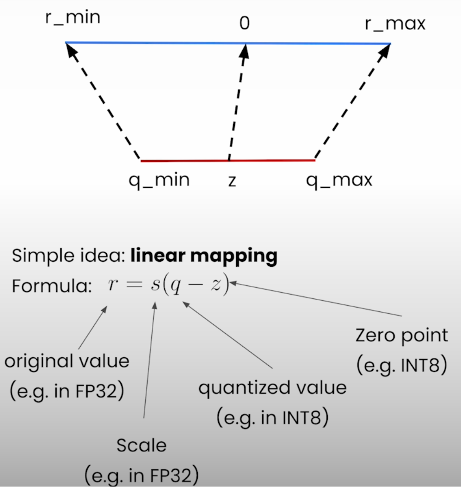
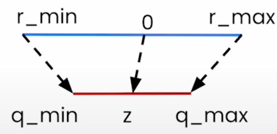
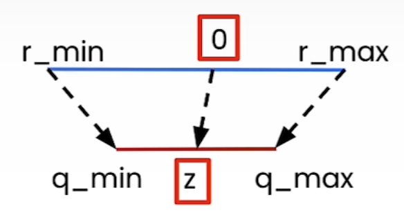

# Quantize and De-quantize a Tensor

## Lesson content

- Dive deep into linear quantization theory
- Implement from scratch assymetric variant of linear quantization
- Learn about scaling factor and the zero point

## Linear Quantization I (Part 1)

### Quantization - Concept
  
- Quantization refers to the process of mapping a large set to a smaller set of values.

### Quantization - Example
  
- 8-bit quantization: map values that are stored in `torch.float32` to `torch.int8` (e.g. between [-128, 127])

### Neural Network Quantization

- You can quantize
  - **Weights**: Neural network parameters
  - **Activations**: Values that propagate through the layers of the neural network
- **Post Training Quantization (PTQ)**
  - Neural network is quantized after it has been trained

### Advantages of Quantization

- Smaller model
- Speed gains
  - Memory bandwidth
  - Faster operations
    - GEMM: General Matrix Multiplication
      - matrix to matrix multiplication
    - GEMV: General Matrix Vector Multiplication
      - matrix to vector multiplication

### Challenges of Quantization

These will be covered in detail in the last lesson of this course.

- Quantization error
- Retraining (Quantization Aware Training)
- Limited hardware support
- Calibration dataset needed
- packing/unpacking

### Linear Quantization

- Scale is stored in same data type as the original tensor
- Zero point is stored in the same data type as the quantizer tensor
- From $q$ to $r$
  - $r = s(q - z)$
- From $r$ to $q$
  - $q = int(round(\frac{r}{s} + z))$

### Notebook (Quantize and De-quantize a Tensor)

- [Jupyter notebook](../code/L2_linear_I_quantize_dequantize_tensor.ipynb)
- Dequantization requires casting of quantized tensor to float
  - My understanding: To avoid integer overflow
- Issue faced:
  - Error raised: `torch/nn/modules/transformer.py:20: UserWarning: Failed to initialize NumPy: _ARRAY_API not found (Triggered internally at ../torch/csrc/utils/tensor_numpy.cpp:84.)`
    - `A module that was compiled using NumPy 1.x cannot be run in
NumPy 2.0.0 as it may crash`
    - Downgrade numpy as mentioned in [StackOverFlow thread](https://stackoverflow.com/questions/78641150/a-module-that-was-compiled-using-numpy-1-x-cannot-be-run-in-numpy-2-0-0)

## Get the Scale and Zero Point

### Scale and Zero Point

- Linear quantization maps the floating point range [$r_{min}$, $r_{max}$] to the quantized range [$q_{min}$, $q_{max}$]
- For the extreme values, we should get
  - $r_{min} = s(q_{min} - z)$
  - $r_{max} = s(q_{max} - z)$
- To get scale $s$, subtract the 1st equation from the 2nd one:
  - $s = (r_{max} - r_{min})/(q_{max} - q_{min})$
- For the zero point z, we need to round the value since it is a n-bit integer
  - $z = int(round(q_{min} - r_{min}/s))$

### Why make z an integer?

- Make z as the same d-type as the quantized tensor.
- This is not same d-type as the scale (s).

### Zero point out of range

- Case 1: $z < q_{min}$
  - Set $z = q_{min}$
- Case 2: $z > q_{max}$
  - Set $z = q_{max}$

### Notebook (Get Scale and Zero Point)

- [Jupyter Notebook](../code/L2_linear_I_get_scale_and_zero_point.ipynb)