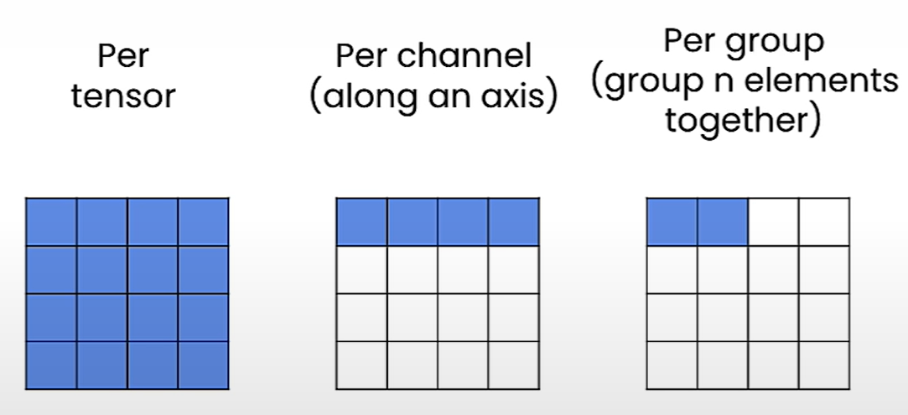

# Get the Scale and Zero Point

## Scale and Zero Point

- Linear quantization maps the floating point range [$r_{min}$, $r_{max}$] to the quantized range [$q_{min}$, $q_{max}$]
- For the extreme values, we should get
  - $r_{min} = s(q_{min} - z)$
  - $r_{max} = s(q_{max} - z)$
- To get scale $s$, subtract the 1st equation from the 2nd one:
  - $s = (r_{max} - r_{min})/(q_{max} - q_{min})$
- For the zero point z, we need to round the value since it is a n-bit integer
  - $z = int(round(q_{min} - r_{min}/s))$

## Why make z an integer?

- Make z as the same d-type as the quantized tensor.
- This is not same d-type as the scale (s).

## Zero point out of range

- Case 1: $z < q_{min}$
  - Set $z = q_{min}$
- Case 2: $z > q_{max}$
  - Set $z = q_{max}$

## Notebook

- [Jupyter Notebook](../code/L2_linear_I_get_scale_and_zero_point.ipynb)
