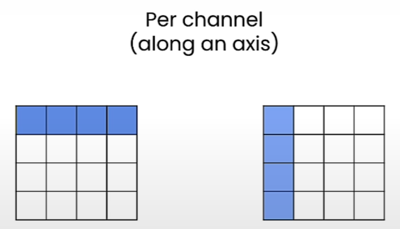

# Symmetric vs Asymmetric Mode

## Lesson content

- [Symmetric mode of linear quantization](#linear-quantization-ii-part-i)
- Implement quantization at different granularity, such as
  - per tensor
  - [per channel](#per-channel-quantization)
  - [per group quantization](#per-group-quantization)
- Check inference on the quantized linear layer

## Linear Quantization II (Part I)

### Linear Quantization Mode

- There are two modes in linear quantization:
  - **Asymmetric**: We map $[r_{min}, r_{max}]$ to $[q_{min}, q_{max}]$
    - Implemented in previous lesson
  - **Symmetric**: We map $[-r_{max}, r_{max}]$ to $[-q_{max}, q_{max}]$
    - where we can set $r_{max} = max(|r_{tensor}|)$

- Symmetric mode
  - Because the floating-point range and the quantized range are symmetric wrt zero, no need to use the zero point ($z=0$)
  - Simplifies the equations to
    - $q = int(round(r/s))$
    - $s = r_{max}/q_{max}$
  

- Trade-off
  - Utilization of quantized range
    - Asymmetric quantization fully utilizes the quantized range
    - In symmetric mode, if the float range is biased towards one side, it will result in a quantized range where a part of the range is dedicated to values that we'll never see.
      - e.g. RELU where the output is positive
  - Simplicity
    - Symmetric mode is much simpler compared to asymmetric mode
  - Memory
    - Zero point for symmetric quantization is not stored

- Practice
  - Symmetric quantization to quantize to 8-bits
  - Asymmetric quantization is often used to quantize to low bits e.g. 2, 3 or 4 bits

### Notebook (Linear Quantization: Symmetric Mode)

- [Jupyter Notebook](../code/L3_linear_II_symmetric_vs_asymmetric.ipynb)

## Finer Granularity for more Precision

### Quantization Different Granularities

- The more granularization, the more accurate it will be. However, it will need more memory since we need to store more quantization parameters.

- The colored values share the same quantization parameters (e.g. scale, zero-point)

### Notebook (Per tensor Quantization)

- [Jupyter Notebook](../code/L3_linear_II_per_tensor.ipynb)

## Per Channel Quantization

- Store the scales and zero point for each **row** if we decide to quantize along the rows.
- Store the scales and zero point for each **column** if we decide to quantize along the columns.
- Usually per-channel quantization is done in 8-bit quantization.

### Notebook (Per Channel Quantization)

- [Jupyter Notebook](../code/L3_linear_II_per_channel.ipynb)

## Per Group Quantization

- Example
  - Let's say we want to optimize a tensor in **4-bit** and we choose
    - group_size = 32
    - symmetric mode
    - Store the scales in FP16
  - It means that we actually quantize the tensor in **4.5 bits** since we have
    - 4 bit (each element is stored in 4 bit)
    - 16/32 bit (scale in 16 bits for every 32 elements)

### Notebook (Per Group Quantization)

- [Jupyter Notebook](../code/L3_linear_II_per_group.ipynb)
- Group elements are chosen from a row.
  - Hence assert added to ensure that number of elements in a row are multiple of group size.
- Group quantization applied using per channel quantization along row after reshaping tensor.

## Quantizing Weights & Activations for Inference

### Inference Linear Quantization

- In a neural network, we can quantize the **weights** as well as **activation**.
- Depending on what we quantize for **storage**, the **computation** varies.
  - Storage: **Quantized** Weight + Activation (e.g. W8A32)
    - Computation: Floating point arithmetics (FP32, FP16, BF16)
    - We need to **dequantize** the weights to perform the floating point computation!
  - Storage: **Quantized** Weight + **Quantized** Activation (e.g. W8A8)
    - Computation: Integer based arithmetics (INT8, INT4, ...)
    - Not supported by all hardware!

### Notebook (Quantizing Weights & Activations for Inference)

- [Jupyter Notebook](../code/L3_linear_II_quantizing_weights_and_activations.ipynb)
- Compares the inference output with/without weight quantization
