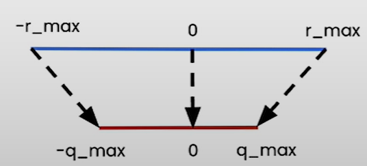

# Symmetric vs Asymmetric Mode

## Lesson content

- Symmetric mode of linear quantization
- Implement quantization at different granularity, such as
  - per tensor
  - per channel
  - per group quantization
- Check inference on the quantized linear layer

## Linear Quantization II (Part I)

### Linear Quantization Mode

- There are two modes in linear quantization:
  - **Asymmetric**: We map $[r_{min}, r_{max}]$ to $[q_{min}, q_{max}]$
    - Implemented in previous lesson
  - **Symmetric**: We map $[-r_{max}, r_{max}]$ to $[-q_{max}, q_{max}]$
    - where we can set $r_{max} = max(|r_{tensor}|)$

- Symmetric mode
  - Because the floating-point range and the quantized range are symmetric wrt zero, no need to use the zero point ($z=0$)
  - Simplifies the equations to
    - $q = int(round(r/s))$
    - $s = r_{max}/q_{max}$
  

- Trade-off
  - Utilization of quantized range
    - Asymmetric quantization fully utilizes the quantized range
    - In symmetric mode, if the float range is biased towards one side, it will result in a quantized range where a part of the range is dedicated to values that we'll never see.
      - e.g. RELU where the output is positive
  - Simplicity
    - Symmetric mode is much simpler compared to asymmetric mode
  - Memory
    - Zero point for symmetric quantization is not stored

- Practice
  - Symmetric quantization to quantize to 8-bits
  - Asymmetric quantization is often used to quantize to low bits e.g. 2, 3 or 4 bits

### Notebook (Linear Quantization: Symmetric Mode)

- [Jupyter Notebook](../code/L3_linear_II_symmetric_vs_asymmetric.ipynb)
