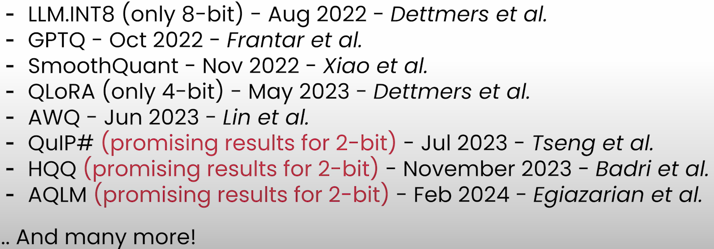

# Weights Packing

## Table of Contents

1. [Challenges in Quantization (Part 1)](#challenges-in-quantization-part-1)
2. [Packing 2-Bit Weights](#packing-2-bit-weights)
3. [Unpacking 2-bit Weights](#unpacking-2-bit-weights)
4. [Beyond Linear Quantization](#beyond-linear-quantization)

## Lesson Content

- Why weights packing is important for storing quantized weights
- Common challenges faced to store and load 2 & 4-bit weights in a packed unint8 tensor
- Implement from scratch weight packing
- Other challenges with quantizing generative models such as LLMs
- Quickly review some state-of-art LLM quantization methods

## Challenges in Quantization (Part 1)

### Why packing is important?
  
- If we want to quantize model into say int4, we can't do that directly as there's no native support for int4 in PyTorch

### How does packing work?

- Explained with the below example of storing 4 values that can be represented in 2-bit precision, but stored in 8-bit

  
  - We want to eliminate the bits highlighted in red.

  
  - 2-bits are packed from rightmost element to left.

- Advantages
  - It reflects the "true" memory footprint of the quantized weights
- Disadvantages
  - The unpacked tensors need to be a shape with a multiple of 8 // nbits
  - It need to unpack before performing an operation

## Packing 2-Bit Weights

### Notebook (Packing 2-Bit Weights)

- [Jupyter Notebook](../code/L5_packing_2bit_weights.ipynb)
- Unsigned 8-bit tensor is used for simplicity to avoid handling 1st bit for sign in signed tensor.

## Unpacking 2-bit Weights

### Notebook (Unpacking 2-bit Weights)

- [Jupyter Notebook](../code/L5_unpacking_2bit_weights.ipynb)

## Beyond Linear Quantization

- Emergent features for LLMs
  - Challenge: Features predicted by the model i.e. magnitude of the hidden states started to become large => Classic quantization schemes quite obsolete

- My understanding:
  - As the classic linear quantization is based on the min and max values in the original data type, outlier impacts these range.

- Outlier features
  - Hidden states with large magnitude

- LLM.int8()
  - Proposes decomposition of matrix multiplication of the linear layers in two stages
    - Two parts:
      - Outlier part
      - Non-outlier part
  - Perform non-outlier part matrix multiplication in int8
    - And then de-quantize using the scales
  - Perform outlier part matrix multiplication using the original data type of the hidden state
  - Then combine the two results.

- SmoothQuant
  - Specifically applies to A8W8 schemes e.g. we want to quantize both activations and weights
  - Intuition: Activation `X` is hard to quantize because outliers stretch the quantization range.
  - Solution: Migrate quantization difficulties from activation to weights

- Recent SOTA quantization methods (chronological order):

### Challenges of Quantization

- Retraining
- Limited Hardware support
  - Focus in this course: W8A16
  - For better quantization, W8A8 scheme could be preferred but not supported by all hardware.
- Calibration dataset needed
- packing / unpacking

### Further reading

- SOTA quantization papers
- MIT Han lab
- transformers quantization docs / blogposts
- llama.cpp discussions
- Reddit (r/LocalLlama)
